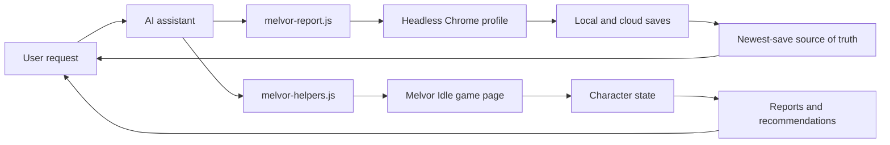

# MPT - Melvor Personal Tooling

[](https://github.com/AlexAgo83/mpt/commits/main)
[](https://github.com/AlexAgo83/mpt/actions/workflows/ci.yml)
[](./LICENSE)
[](https://melvoridle.com/)
[](./melvor-report.js)
[](./logics/)

MPT is a local AI-assistant toolkit for operating a Melvor Idle account through a logged-in Chrome profile.

It gives Codex, Claude, or any MCP-capable assistant a small, documented surface for reading account state, auditing characters, planning equipment swaps, and safely handling cloud/local save drift.

## Overview



## What it does

- Reads Melvor Idle character slots from the shared Chrome profile
- Compares local and cloud saves before risky work
- Resolves the source of truth as the newest save
- Generates account summaries, audits, gear views, skilling views, and plans
- Exports structured state for deeper AI recommendations
- Records assistant-improvement reports after messy sessions
- Documents the live browser workflow for Codex and Claude handoff

## Safety model

Source of truth is the newest save, local or cloud.

Before any write:

```bash
./melvor-report.js slots
./melvor-report.js source-of-truth
```

Rules:

- Treat local/cloud disagreement as a stop sign until the intended source is clear.
- Never open the same character in two tabs.
- Do not load an older cloud save over a newer local save unless explicitly requested.
- Use `mh.equipSlot(item, slot)` for manual equipment changes.
- After approved writes, save, wait for cloud push, reload, and verify.
- After confusing behavior, run `./melvor-report.js improve --record`.

## Commands

```bash
npm run slots
npm run source
./melvor-report.js slots
./melvor-report.js diff-slots
./melvor-report.js source-of-truth
./melvor-report.js improve
./melvor-report.js improve --record
./melvor-report.js summary all
./melvor-report.js audit all
./melvor-report.js plan all
./melvor-report.js gear <character>
./melvor-report.js skilling <character>
./melvor-report.js export-state all > /tmp/melvor-state.json
```

All report commands are read-only.

## Character roster

The current configured account roster is:

- `GrifhinZ`
- `Rya`
- `Dash`
- `Edalbraw`
- `Opa`
- `Chap`
- `Kang`

## Browser setup

The tooling uses Chrome DevTools against the shared profile:

```text
~/.cache/chrome-devtools-mcp/chrome-profile
```

That profile must stay logged into Melvor Cloud. Chrome locks the profile, so only one assistant/browser driver should use it at a time.

If login expires, open the same profile visibly, let the user log in, then return to headless operation.

## Repository layout

- [`melvor-report.js`](./melvor-report.js): read-only CLI reports and source-of-truth checks
- [`melvor-helpers.js`](./melvor-helpers.js): injected `window.mh` browser helper library
- [`package.json`](./package.json): standard local command aliases, no dependencies
- [`MELVOR.md`](./MELVOR.md): full operating manual for AI assistants
- [`MELVOR_RUNBOOK.md`](./MELVOR_RUNBOOK.md): short runbook for common workflows
- [`AI_IMPROVEMENTS.md`](./AI_IMPROVEMENTS.md): ledger for repeated assistant failures and improvements
- [`CONTRIBUTING.md`](./CONTRIBUTING.md): contribution and validation workflow
- [`SECURITY.md`](./SECURITY.md): local security model and reporting policy
- [`LICENSE`](./LICENSE): MIT license
- [`logics/`](./logics/): product and workflow context
- [`AGENTS.md`](./AGENTS.md), [`CLAUDE.md`](./CLAUDE.md): assistant entrypoints

## Validation

```bash
npm run check
npm run help
```

For workflow docs:

```bash
logics-manager status
logics-manager lint --require-status
logics-manager audit --group-by-doc
```

## CI

GitHub Actions runs the dependency-free syntax check on pushes and pull requests:

```bash
npm run check
```

The workflow also has a manual `workflow_dispatch` smoke slot for a future live Melvor
test account. It expects these GitHub secrets when enabled:

- `MELVOR_TEST_EMAIL`
- `MELVOR_TEST_PASSWORD`

The live smoke is intentionally a placeholder until the test-account login flow is stable
and non-destructive.

## Project status

This is local-first tooling for one Melvor account, not a public mod or hosted service.

Current focus:

- reliable save-source detection
- safe assistant handoff between Codex and Claude
- compact account audits and recommendations
- promoting repeated manual browser scripts into CLI commands only when they keep recurring

## Framework decision

The project intentionally stays as plain Node.js scripts: no build step, no runtime
dependencies, no custom framework. `package.json` only provides standard command aliases.

## References

- [Melvor operating manual](./MELVOR.md)
- [Runbook](./MELVOR_RUNBOOK.md)
- [AI improvement ledger](./AI_IMPROVEMENTS.md)
- [Contributing](./CONTRIBUTING.md)
- [Security policy](./SECURITY.md)
- [Product brief](./logics/product/prod_001_melvin_ai_assistant_for_melvor_idle.md)
