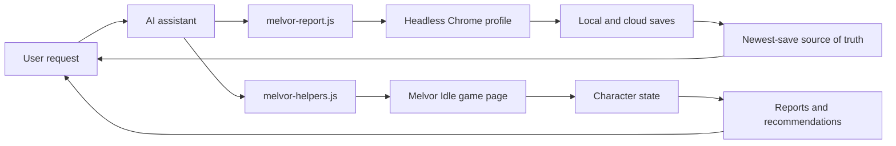

# MPT - Melvor Personal Tooling

[](https://github.com/AlexAgo83/mpt/commits/main)
[](https://github.com/AlexAgo83/mpt/actions/workflows/ci.yml)
[](./LICENSE)
[](https://melvoridle.com/)
[](./melvor-report.js)
[](./logics/)

MPT is a local AI-assistant toolkit for operating a Melvor Idle account through a logged-in Chrome profile.

It gives Codex, Claude, or any MCP-capable assistant a small, documented surface for reading account state, auditing characters, planning equipment swaps, and safely handling cloud/local save drift.

## Overview



## What it does

- Reads Melvor Idle character slots from the shared Chrome profile
- Compares local and cloud saves before risky work
- Resolves the source of truth as the newest save
- Generates account summaries, audits, gear views, skilling views, and plans
- Generates compact `brief` JSON with source-of-truth, current-action, standard, and abyssal recommendations
- Estimates current-action status, including idle/stopped actions, skill intervals, Slayer ETA, and equipped consumable/ammo runway
- Exports structured state for deeper AI recommendations
- Keeps an append-only character journal with a structured snapshot, action ledger, Melvor-themed offline dashboard, and recent recommendation history
- Records assistant-improvement reports after messy sessions
- Documents the live browser workflow for Codex and Claude handoff

## Safety model

Source of truth is the newest save, local or cloud.

Before any write:

```bash
./melvor-report.js slots
./melvor-report.js source-of-truth
```

Rules:

- Treat local/cloud disagreement as a stop sign until the intended source is clear.
- Never open the same character in two tabs.
- Do not load an older cloud save over a newer local save unless explicitly requested.
- Use `mh.equipSlot(item, slot)` for manual equipment changes.
- After approved writes, save, wait for cloud push, reload, and verify.
- After confusing behavior, run `./melvor-report.js improve --record`.

## Commands

```bash
npm run slots
npm run source
./melvor-report.js smoke
./melvor-report.js login-smoke
./melvor-report.js slots
./melvor-report.js diff-slots
./melvor-report.js source-of-truth
./melvor-report.js improve
./melvor-report.js improve --record
./melvor-report.js brief all
./melvor-report.js brief <character>
./melvor-report.js summary all
./melvor-report.js audit all
./melvor-report.js plan all
./melvor-report.js combat-plan all
./melvor-report.js combat-plan <character> --abyssal
./melvor-report.js gear <character>
./melvor-report.js skilling <character>
./melvor-report.js export-state all > /tmp/melvor-state.json
./melvor-report.js journal GrifhinZ
./melvor-report.js journal all --record
./melvor-report.js journal-action <id> dismissed
```

All report commands are read-only.

`brief` is the preferred command for AI account triage. It returns one compact JSON object
per character with:

- `source`: newest-save source and write-block risk
- `currentAction`: current task, action-specific recommendations, rough intervals, Slayer
  ETA, equipped food, and ammo/scroll/summon/consumable runway when the game exposes enough
  data; when `journal/latest.json` exists it also includes `levelEtas` with either ready
  ETA lines or the pending reason
- `standard`: standard-level gaps, accessible standard dungeons, and standard next steps
- `abyssal`: abyssal-level gaps, abyssal dungeons such as `Into the Abyss`, and abyssal next
  steps; Cartography and Archaeology are intentionally excluded because they do not have
  trainable Abyssal Levels
- `risks` and `next`: short top-level prompts for the assistant/user

## Journal

`journal [all|character]` prints a Markdown entry per character (state, save-risk context,
recommendations, current-action plan, standard plan, abyssal plan, proposed actions, history).
`--record` writes into the git-ignored `journal/` directory:

- `journal/<Character>.md`: append-only Markdown journal per character
- `journal/latest.json`: structured snapshot; per character it separates `observed` (game
  state), `analysis` (assistant interpretation), and `decisions` (user/session decisions)
- `journal/actions.jsonl`: append-only action ledger with stable action ids, status,
  risk, reason, timestamps, and a context hash
- `journal/index.html`: offline interactive dashboard (search, action/risk/status filters,
  stale highlighting, account indicators, per-character detail, Melvor-themed styling,
  current-action recommendations, a side drawer for recent journal history, and links to
  the Markdown files)
- `Level ETA`: projected time to next level, next 10-level milestone, and current cap when
  two journal snapshots have enough standard XP gain to estimate a rate; otherwise it
  explains what data is still missing

The dashboard highlights stopped/idle characters. If a character was previously doing a
task and is now idle, the next journal refresh records a recommendation such as "current
action stopped after Smithing; check resources/recipe inputs before restarting".
Level ETA is intentionally snapshot-based: the first scan records XP, and later scans show
projections only when enough time and XP changed to produce a useful estimate.

Action lifecycle statuses: `proposed` → `approved` → `done`, or `blocked` / `dismissed`;
an open action becomes `done` automatically when the observed equipment matches it, or
`stale` when the observed state no longer produces the recommendation. Change a status
manually with `journal-action <id> <approved|dismissed|done|blocked>` (offline, no browser).
Dismissed/done/blocked actions are not re-proposed unless their context hash changes.
Journal generation is read-only against the game and never writes secrets, save strings, or
local profile paths. `journal/` is private local player data: it is git-ignored and must
never be committed. Executing actions stays out of scope — any future apply-action flow
still requires `source-of-truth` checks and explicit user approval.

## Character roster

The current configured account roster is:

- `GrifhinZ`
- `Rya`
- `Dash`
- `Edalbraw`
- `Opa`
- `Chap`
- `Kang`

## Browser setup

The tooling uses Chrome DevTools against the shared profile:

```text
~/.cache/chrome-devtools-mcp/chrome-profile
```

That profile must stay logged into Melvor Cloud. Chrome locks the profile, so only one assistant/browser driver should use it at a time.

If login expires, open the same profile visibly, let the user log in, then return to headless operation.

Local account settings can live in `.env.local`, copied from [`.env.example`](./.env.example).
That file is git-ignored. It supports both the main profile and a separate test profile:

```bash
cp .env.example .env.local
npm run slots
npm run test:slots
```

## Repository layout

- [`melvor-report.js`](./melvor-report.js): read-only CLI reports and source-of-truth checks
- [`melvor-helpers.js`](./melvor-helpers.js): injected `window.mh` browser helper library
- [`test-journal.js`](./test-journal.js): offline self-check for the journal logic (part of `npm run check`)
- [`package.json`](./package.json): standard local command aliases, no dependencies
- `journal/` (git-ignored): generated player journal — Markdown entries, `latest.json`, `actions.jsonl`, `index.html`
- [`.env.example`](./.env.example): local-only account/profile configuration template
- [`MELVOR.md`](./MELVOR.md): full operating manual for AI assistants
- [`MELVOR_RUNBOOK.md`](./MELVOR_RUNBOOK.md): short runbook for common workflows
- [`AI_IMPROVEMENTS.md`](./AI_IMPROVEMENTS.md): ledger for repeated assistant failures and improvements
- [`CONTRIBUTING.md`](./CONTRIBUTING.md): contribution and validation workflow
- [`SECURITY.md`](./SECURITY.md): local security model and reporting policy
- [`LICENSE`](./LICENSE): MIT license
- [`logics/`](./logics/): product and workflow context
- [`AGENTS.md`](./AGENTS.md), [`CLAUDE.md`](./CLAUDE.md): assistant entrypoints

## Validation

```bash
npm run check
npm run help
```

For workflow docs:

```bash
logics-manager status
logics-manager lint --require-status
logics-manager audit --group-by-doc
```

## CI

GitHub Actions runs the dependency-free syntax check on pushes and pull requests:

```bash
npm run check
```

The workflow also has a manual `workflow_dispatch` smoke for the live Melvor test account.
It expects these GitHub secrets when enabled:

- `MELVOR_TEST_EMAIL`
- `MELVOR_TEST_PASSWORD`

The live smoke is read-only. It can log into the test account with GitHub secrets, but it
does not create characters or mutate saves.

## Project status

This is local-first tooling for one Melvor account, not a public mod or hosted service.

Current focus:

- reliable save-source detection
- safe assistant handoff between Codex and Claude
- compact account audits and recommendations
- promoting repeated manual browser scripts into CLI commands only when they keep recurring

## Framework decision

The project intentionally stays as plain Node.js scripts: no build step, no runtime
dependencies, no custom framework. `package.json` only provides standard command aliases.

## References

- [Melvor operating manual](./MELVOR.md)
- [Runbook](./MELVOR_RUNBOOK.md)
- [AI improvement ledger](./AI_IMPROVEMENTS.md)
- [Contributing](./CONTRIBUTING.md)
- [Security policy](./SECURITY.md)
- [Product brief](./logics/product/prod_001_melvin_ai_assistant_for_melvor_idle.md)
