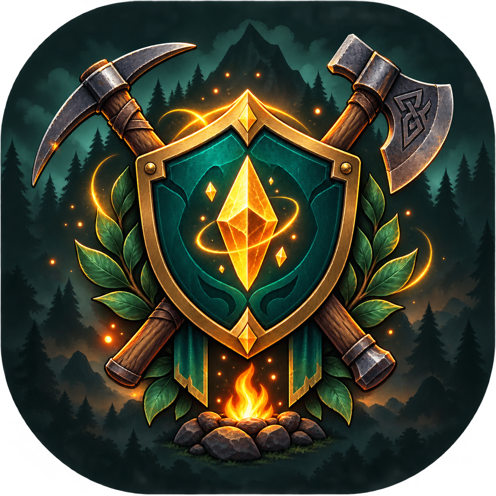
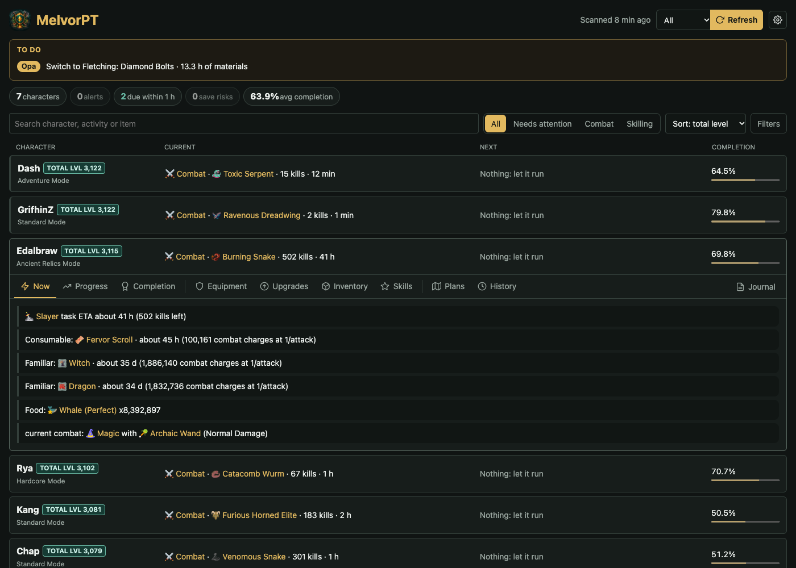

# MelvorPT

<p align="center"></p>

<p align="center"><b>Your whole Melvor Idle account, one private dashboard, with an AI co-pilot that never risks your save.</b></p>

<p align="center">

[](https://github.com/AlexAgo83/mpt/commits/main)
[](https://github.com/AlexAgo83/mpt/actions/workflows/ci.yml)
[](./LICENSE)
[](https://melvoridle.com/)
[](./melvor-report.js)

</p>



Running seven characters across Standard, Hardcore, Adventure and Ancient Relics means
seven Slayer tasks, seven sets of scrolls running dry and seven saves that can drift between
local and cloud. MelvorPT puts all of them on one page and lets Claude, Codex or any MCP
assistant read, plan and act for you, one reviewed change at a time.

## Why you'll like it

- **See everything at once.** Current action, Slayer ETA, food, ammo and scroll runway,
  level ETAs and idle alerts for every character on one dashboard.
- **Know what to do next.** Gear upgrade plans with real passives, dungeon targets, abyssal
  gaps and skilling plans, ranked per character.
- **Pick a goal per character.** Progression, dungeon path, completion, a target item, profit, AFK,
  Hardcore safe and more: the plan, the Next column and To do follow it.
- **Track your completion.** Completion Log progress per expansion and category, with the
  gain since your last check.
- **Ask your AI.** "Who runs out of scrolls first?", "Is Kang ready for Into the Abyss?"
  Your assistant reads the live account instead of guessing.
- **Never lose a save.** The newest save, local or cloud, always wins. Every change is a
  preview first, applies to one character only and is verified after the save.
- **Stays private.** Runs on your machine, uses your own logged-in browser and never sees
  your credentials. No server, no dependencies, no build step.

## Get started

```bash
cp .env.example .env.local        # list your characters: MELVOR_CHARACTERS=Main,Alt1
./melvor-report.js journal-serve  # then open http://127.0.0.1:8787
```

Log in once through the official Melvor page if asked. Then try:

```bash
./melvor-report.js brief all          # what every character is doing and what's next
./melvor-report.js completion all     # Completion Log progress
./melvor-report.js combat-plan <name> # next dungeons and the set to use
```

## Documentation

| Guide | What's inside |
|---|---|
| [Setup and safety](docs/setup.md) | Browser profile, login, `.env.local`, save rules |
| [Commands](docs/commands.md) | Every command, read-only vs. guarded writes, the `brief` format |
| [Journal and dashboard](docs/journal.md) | History, action ledger, level ETAs, save backups |
| [AI operating manual](MELVOR.md) | How assistants drive the game safely |
| [Runbooks](MELVOR_RUNBOOK.md) | Step-by-step procedures (dungeons, gear, saves…) |
| [Development](docs/development.md) | Repository layout, validation, CI |

## License

MIT, see [LICENSE](./LICENSE). A fan-made tool, not affiliated with Games by Malcs.
