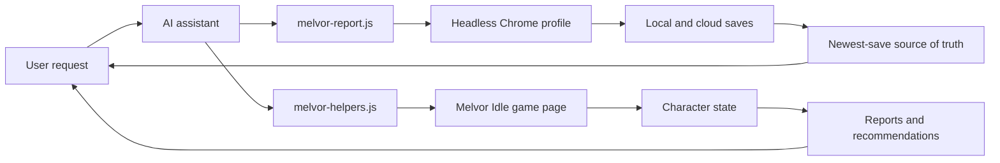

# Development

## Architecture



## What it does

- Reads Melvor Idle character slots from the shared Chrome profile
- Compares local and cloud saves before risky work
- Resolves the source of truth as the newest save
- Generates account summaries, audits, gear views, skilling views, and plans
- Generates compact `brief` JSON with source-of-truth, current-action, standard, and abyssal recommendations
- Estimates current-action status, including idle/stopped actions, skill intervals, Slayer ETA, and equipped consumable/ammo runway
- Exports structured state for deeper AI recommendations
- Tracks Completion Log progress (total, per expansion, per category) with deltas between records
- Keeps an append-only character journal with a structured snapshot, action ledger, Melvor-themed offline dashboard, and recent recommendation history
- Records assistant-improvement reports after messy sessions
- Documents the live browser workflow for Codex and Claude handoff

## Repository layout

- [`melvor-report.js`](../melvor-report.js): read-only CLI reports and source-of-truth checks
- [`melvor-helpers.js`](../melvor-helpers.js): injected `window.mh` browser helper library
- [`test-journal.js`](../test-journal.js): offline self-check for the journal logic (part of `npm run check`)
- [`package.json`](../package.json): standard local command aliases, no dependencies
- `journal/` (git-ignored): generated player journal, private incident history, promotion ledger, and dashboard
- [`.env.example`](../.env.example): local-only account/profile configuration template
- [`MELVOR.md`](../MELVOR.md): full operating manual for AI assistants
- [`logics/runbook/`](../logics/runbook/): operational Melvor runbook library
- [`AI_IMPROVEMENTS.md`](../AI_IMPROVEMENTS.md): ledger for repeated assistant failures and improvements
- [`CONTRIBUTING.md`](../CONTRIBUTING.md): contribution and validation workflow
- [`changelogs/`](../changelogs/): release notes
- [`SECURITY.md`](../SECURITY.md): local security model and reporting policy
- [`LICENSE`](../LICENSE): MIT license
- [`logics/`](../logics/): product and workflow context
- [`AGENTS.md`](../AGENTS.md), [`CLAUDE.md`](../CLAUDE.md): assistant entrypoints

## Validation

```bash
npm run check
npm run help
```

For workflow docs:

```bash
logics-manager status
logics-manager lint --require-status
logics-manager audit --group-by-doc
```

## CI

GitHub Actions runs the dependency-free syntax check on pushes and pull requests:

```bash
npm run check
```

The workflow also has a manual `workflow_dispatch` smoke for the live Melvor test account.
It expects these GitHub secrets when enabled:

- `MELVOR_TEST_EMAIL`
- `MELVOR_TEST_PASSWORD`

The live smoke is read-only. It can log into the test account with GitHub secrets, but it
does not create characters or mutate saves.

## Project status

This is local-first tooling for one Melvor account, not a public mod or hosted service.

Current focus:

- reliable save-source detection
- safe assistant handoff between Codex and Claude
- compact account audits and recommendations
- promoting repeated manual browser scripts into CLI commands only when they keep recurring

## Framework decision

The project intentionally stays as plain Node.js scripts: no build step, no runtime
dependencies, no custom framework. `package.json` only provides standard command aliases.

Product context: [product brief](../logics/product/prod_001_melvin_ai_assistant_for_melvor_idle.md), [AI improvement ledger](../AI_IMPROVEMENTS.md), [contributing](../CONTRIBUTING.md), [security policy](../SECURITY.md).
