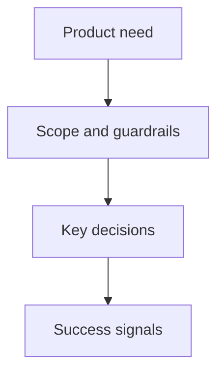

## prod_001_melvin_ai_assistant_for_melvor_idle - Melvin - AI assistant for Melvor Idle
> Date: 2026-07-04
> Status: Proposed
> Related request: (none yet)
> Related backlog: (none yet)
> Related task: (none yet)
> Related architecture: (none yet)
> Reminder: Update status, linked refs, scope, decisions, success signals, and open questions when you edit this doc.

# Overview
Melvin (working title, project codename MPT) is an AI assistant for the browser game
Melvor Idle. The player talks to the assistant in a chat session (Claude Code today) and the
assistant reads and manipulates the live game directly through the browser console — auditing
gear, equipping items, switching characters, and eventually driving every in-game activity
across the account's 7 characters.

The core loop is already proven: a chrome-devtools MCP server drives a headless Chrome with a
persistent logged-in profile; a console helper library (`melvor-helpers.js`, `window.mh`)
exposes game primitives; `MELVOR.md` documents the whole surface so any MCP-capable AI client
(Claude Code, Codex) can operate it. Real outcomes shipped during discovery: gear audits with
passive-aware recommendations and applied equipment swaps worth +13-15% effective DPS on two
characters, automated character switching, and validated multi-tab multi-character operation.

# Goals
- Chat-driven game control: every meaningful game action reachable through conversation,
  with the assistant doing the reading, deciding-support, and clicking.
- Rich helper layer (`window.mh`): grow from today's read/equip primitives to full action
  coverage — start/stop activities, combat area and monster selection, slayer tasks, shop
  purchases, bank management (sell/open/claim), food and prayer management.
- Multi-character operation: safe parallel control of the account's 7 characters
  (one tab per character, duplicate-character guard, per-slot cloud saves) with aggregated
  reporting across all of them.
- Account dashboard (the killer feature): on request, the assistant generates an up-to-date
  multi-character dashboard (Artifact) — all 7 characters, current activity, idle alerts,
  slayer progress — which neither the game nor any existing mod provides. Live data for open
  tabs, cloud-save metadata (with freshness timestamp) for characters that are not loaded.
- Client-agnostic tooling: everything documented in `MELVOR.md` so any MCP-capable AI client
  can operate the game the same way.

# Non-goals
- A standalone chat application or web app: the chat surface IS the AI client (Claude Code,
  Codex); we do not rebuild it.
- A cockpit panel injected into the game page: incompatible with headless operation (nobody
  would see it). Kept in reserve for a future manual-play mode; the dashboard is generated
  by the assistant instead.
- A permanently running monitoring service: Melvin is an on-demand copilot, not a 24/7
  butler. Periodic account checks, if ever wanted, will use the harness's scheduled
  sessions — a command, not an infra.
- Full unattended automation/botting loops: the assistant acts on user instruction in a live
  conversation, it is not a scheduled bot farm.
- An automatic gear recommender inside the helper layer: stat+passive comparison requires
  contextual judgment (zone, slayer task, risk tolerance) — that judgment is the assistant's
  job, helpers only surface complete data.
- Multiplayer/other-player tooling: single account, local browser, player's own saves only.

# Scope and guardrails
- In: `melvor-helpers.js` (read + action primitives), assistant-generated account dashboard,
  `MELVOR.md` operating manual, multi-tab orchestration, character switch automation via
  `initScript`.
- Out: game client modifications beyond console injection, external services, save-file
  editing outside the game's own APIs.
- Guardrail: `mh.backupSave()` (export the save string to a timestamped file in
  `logics/external/`) before any destructive action helper runs (sell, open, buy).
  Ships before the action helpers themselves.
- Guardrail: never load the same character in two tabs (save corruption) — enforced by the
  BroadcastChannel guard in `mh.loadCharacter`.
- Guardrail: cloud-save (`mh.save()`) before character switches and tab closes.
- Guardrail: one AI client drives the browser at a time (Chrome profile lock).
- Guardrail: helpers return JSON-serializable data only; always check item passives before
  gear conclusions (passives flip raw-stat verdicts).

# Key product decisions
- Reuse chrome-devtools MCP as the entire access layer — no custom extension, no custom MCP
  server, no CLI wrapper. Zero infra to maintain.
- Headless Chrome with a persistent logged-in profile; temporary visible mode only for
  login/captcha recovery.
- The helper library lives in one plain JS file injected per session (re-injected on reload
  via `navigate_page` initScript); no build step, no dependencies.
- The dashboard is generated by the assistant (Artifact) rather than injected into the game
  page: consistent with headless operation, zero code living in the page. Data: live for
  open tabs, cloud-save metadata from the selection screen for the rest.
- Build order: 1) `mh.backupSave()` safety net, 2) action helpers, 3) account dashboard.
- Iterate helper-by-helper, each one validated live in the real game before being persisted.
- Working name "Melvin" (final name TBD — candidates: Melvin, Sage, Overseer, Atlas).

# Success signals
- Any game action the player asks for in chat completes without the player touching the game.
- A full account status report (all 7 characters) is one request away.
- Character switch or multi-tab session setup requires zero manual steps and zero
  rediscovery (all knowledge in `MELVOR.md` + helpers).
- Every destructive action is preceded by an automatic save backup that can restore the
  character.
- A fresh AI client (e.g. Codex) can operate the game from repo docs alone.

# Open questions
- Final product name (Melvin / Sage / Overseer / Atlas / other).
- Whether action helpers should cover non-combat skilling verbs individually or through one
  generic `mh.startActivity(skill, recipe)` primitive.
- How far multi-character parallelism should go by default (all 7 tabs vs. on-demand).

# References
- Product back-reference: (none yet)
- Task back-reference: (none yet)
- `MELVOR.md` — operating manual (setup, session flow, helpers, pitfalls)
- `melvor-helpers.js` — injected helper library (`window.mh`)
- `logics/external/melvin-cockpit-mockup.html` — UX mockup: game + chat + multi-character
  cockpit overlay (not versioned; also published at
  https://claude.ai/code/artifact/dd7fc750-11a5-4192-b4f7-9cd19eb59ea8)
