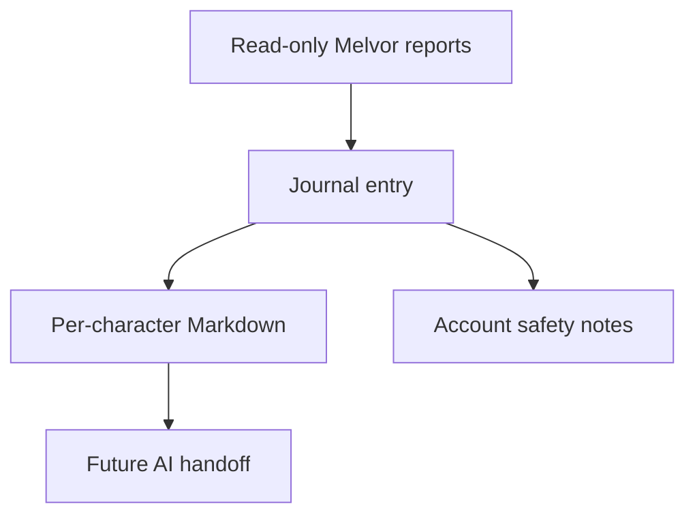

## prod_002_melvin_character_journal_and_planning_log - Melvin - character journal and planning log
> Date: 2026-07-05
> Status: Proposed
> Related request: `req_000_character_journal_generation_for_melvor_planning`
> Related backlog: `item_001_add_append_only_character_journal_command`
> Related task: `task_001_implement_and_validate_character_journal_generation`
> Related architecture: (none yet)
> Reminder: Update status, linked refs, scope, decisions, success signals, and open questions when you edit this doc.

# Overview
Extend the Melvin local assistant with a lightweight, append-only journal that turns current Melvor account readings into per-character planning notes. The journal is a durable handoff surface for future AI sessions: what each character is doing, what the assistant recommends next, what actions are proposed, and what safety checks matter before writes.

# Goals
- Make each character's current state and next optimization steps reviewable without rerunning a full browser session.
- Give future AI sessions a concise historical trail per character.
- Keep the journal human-readable and git-friendly.
- Preserve the existing read-only safety model for report commands.

# Non-goals
- No database, hosted dashboard, or web UI.
- No automatic execution of proposed actions.
- No Markdown parser or task-state engine in the first iteration.
- No account secrets or save backups in generated journal files.

# Scope and guardrails
- In: `melvor-report.js` journal command, Markdown rendering, optional append-only writes under `journal/`, README and runbook documentation.
- Out: database storage, hosted dashboard, Markdown task-state parser, automatic action execution, and save mutation.
- Guardrail: journal generation is read-only and must not call equip, save, sell, buy, open, claim, or other mutation helpers.
- Guardrail: generated files must not contain credentials, save strings, environment variables, or local Chrome profile paths.

# Key product decisions
- Store the first journal as Markdown files because the repo is local-first and dependency-free.
- Append entries instead of rewriting historical notes; history should be simple to audit in git.
- Reuse existing `summary`, `audit`, `plan`, `slots`, and `source-of-truth` data instead of adding a second browser scrape path.
- Defer structured action tracking until simple append-only Markdown is too hard to review manually.

# Success signals
- `journal <character>` prints a complete Markdown entry without writing files.
- `journal all --record` appends one file per configured character.
- A future AI session can read the latest character file and understand current state, recommendations, proposed actions, and save-risk notes.
- Existing validation stays green with no new runtime dependencies.

# References
- Product back-reference: `req_000_character_journal_generation_for_melvor_planning`
- Task back-reference: `task_001_implement_and_validate_character_journal_generation`
