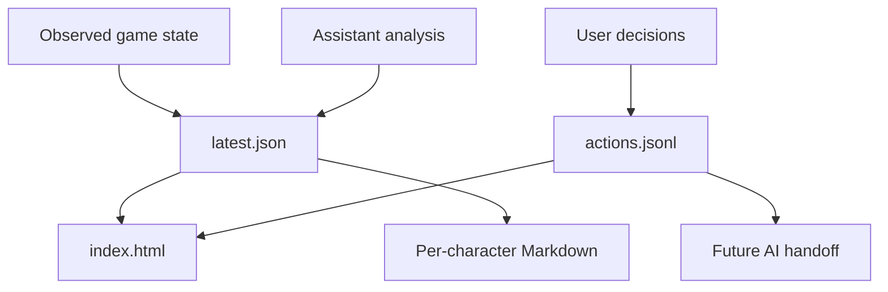

## prod_003_melvin_journal_operating_model_and_dashboard - Melvin - journal operating model and dashboard
> Date: 2026-07-05
> Status: Active
> Related request: `req_001_journal_operating_model_and_interactive_dashboard`
> Related backlog: `item_002_create_structured_journal_snapshot_and_action_ledger`, `item_003_generate_interactive_offline_journal_dashboard`, `item_004_document_journal_lifecycle_and_ai_handoff_rules`
> Related task: `task_002_implement_journal_data_model_ledger_dashboard_and_lifecycle_docs`
> Related architecture: (none yet)
> Reminder: Update status, linked refs, scope, decisions, success signals, and open questions when you edit this doc.
> Confidence: 86

# Overview
Turn the character journal into a small local operating system for Melvor planning: a trusted latest snapshot, an append-only action ledger, human-readable per-character notes, and an offline dashboard. The core product value is not just visual polish; it is preventing future AI sessions from rediscovering state, repeating dismissed recommendations, or confusing observations with decisions.

# Goals
- Separate observed game state, assistant analysis, and user decisions in generated data.
- Make per-character planning durable across AI sessions.
- Give the player a dense dashboard for account triage: save risk, stale data, pending actions, and top recommendations.
- Preserve the safety model: read-only generation first, explicit user approval before any future mutation workflow.
- Keep generated player artifacts local, private, git-ignored, and dependency-free.

# Non-goals
- No hosted service, database, background monitor, scheduled bot, or server.
- No automatic action execution or apply-plan command in this corpus.
- No frontend framework, package dependency, or build step.
- No attempt to parse and rewrite old Markdown checkboxes as the system of record.
- No save-string backup or destructive action helper work in this corpus.

# Scope and guardrails
- In: `journal/latest.json`, `journal/actions.jsonl`, per-character Markdown, generated `journal/index.html`, action lifecycle rules, and documentation updates.
- Out: action execution, apply-plan/apply-action commands, hosted services, background monitoring, save backup helpers, and destructive Melvor helpers.
- Guardrail: journal generation and dashboard generation are read-only and must not call equip, save, sell, buy, open, claim, or other mutation helpers.
- Guardrail: generated artifacts must not include credentials, environment variables, save strings, absolute Chrome profile paths, or raw browser debugging URLs.
- Guardrail: generated `journal/` artifacts are player-private local output and must not be committed.

# Key product decisions
- Treat `latest.json` as the dashboard's machine-readable source of truth; Markdown is for humans and AI handoff, not parsing.
- Treat `actions.jsonl` as the append-only decision ledger; status changes are new events, not in-place rewrites.
- Use stable action ids and context hashes so reruns can suppress duplicates and detect stale recommendations.
- Generate `index.html` as a single offline file with embedded CSS/JS and no external assets.
- Ignore the generated `journal/` directory in git; version only implementation code, docs, and scaffold/context-pack inputs.
- Keep future mutation workflows separate; this corpus only prepares and visualizes decisions.

# Success signals
- A future AI can read `latest.json` and `actions.jsonl` before recommending anything and avoid repeating dismissed work.
- The player can open `journal/index.html` locally and immediately see account risk, stale characters, pending actions, and top recommendations.
- `journal all --record` produces all journal artifacts from one read-only collection pass.
- Existing checks stay green and no runtime dependencies are added.

# References
- Product back-reference: `req_001_journal_operating_model_and_interactive_dashboard`
- Task back-reference: `task_002_implement_journal_data_model_ledger_dashboard_and_lifecycle_docs`
