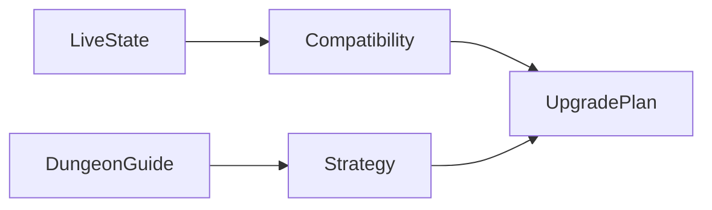

## prod_007_melvin_action_aware_upgrade_planning - Melvin - action-aware upgrade planning
> Date: 2026-08-16
> Status: Proposed
> Related request: `req_005_action_aware_equipment_upgrade_plans`
> Related backlog: `item_008_build_compatible_loot_and_craft_upgrade_plans`
> Related task: `task_006_implement_action_aware_equipment_upgrade_plans`
> Related architecture: (none yet)
> Reminder: Update status, linked refs, scope, decisions, success signals, and open questions when you edit this doc.
> Indicators reviewed: 2026-08-16 12:23:17

# Overview
Turn the journal from a broad recommendation surface into a reliable equipment progression planner. Each plan is grounded in the character's live activity and game registry metadata, then optionally enriched with an official strategy guide for a fixed dungeon. The player can see which loot or craft to pursue next without being sent toward incompatible expansion or damage-type gear.

# Goals
- Recommend acquisition paths per equipped slot, not only stat comparisons.
- Keep compatibility and prerequisite evaluation in the live game-data layer.
- Make dungeon plans strategy-aware without treating a changing Slayer task as a fixed dungeon.
- Expose clear, non-mutating plans in the local dashboard.

# Non-goals
- No automatic item crafting, looting, equipping, combat changes, or save writes.
- No scraping arbitrary third-party sites or treating wiki prose as authoritative compatibility data.
- No new frontend framework, database, hosted service, or dependency.
- No full optimizer for every future game state beyond the current action and candidates.

# Scope and guardrails
- In: scaffolded request, product, backlog, orchestration task, validation, and handoff context.
- Out: unrelated workflow docs and implementation of generated tasks.

# Key product decisions
- Use structured input as the source of truth for generated docs.
- Keep generated write paths local and repo-bounded.

# Success signals
- Generated docs pass lint and audit without broad manual rewrites.
- Context-pack output can be handed to an implementation agent directly.

# References
- Product back-reference: `req_005_action_aware_equipment_upgrade_plans`
- Task back-reference: `task_006_implement_action_aware_equipment_upgrade_plans`
